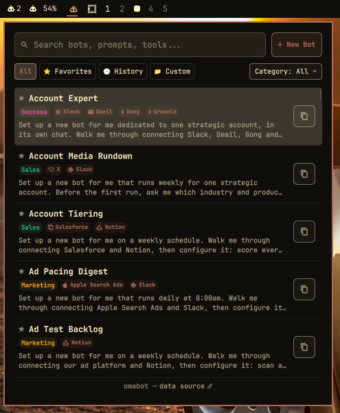

# 🤖 Omabot — AI Bot & Prompt Directory for Omarchy

[](LICENSE)
[](https://github.com/jvlianodorneles/omabot)
[](https://github.com/elie222/botdirectory.ai)

**Omabot** is a native, modern, flat-design status bar plugin and popup directory for [Omarchy](https://github.com/jvlianodorneles/omabot) that lets you search, explore, read full prompts, and 1-click copy AI bot system prompts from [botdirectory.ai](https://github.com/elie222/botdirectory.ai).

<p align="center">
  
</p>

---

## ✨ Features

* **🤖 Always-Active Status Bar Widget**: Displays a vibrant, always-active status icon on the main bar with tooltips and popout coordination.
* **🎨 Customizable Bar Icons**: Choose from 8 preset styles (`robot` `󰚩`, `sparkles` `󱐋`, `brain` `󰘦`, `prompt` `󰅩`, `bot` `󱚡`, `chip` `󰍛`, `terminal` `󰆍`, `alien` `󰚥`) or supply your own custom Unicode/Nerd Font character. Right-click the widget to cycle through icons instantly!
* **🎛️ Quick Scope Filter Bar**: 1-click toggle pills for `All`, `⭐ Favorites`, `🕒 History`, `📁 Custom`, and category dropdowns.
* **🔍 Instant Search & Ranking**: Real-time keyword filtering with relevance scoring across bot names, system prompt contents, categories, integration tools, and contributor tags.
* **📖 Full Prompt Detail View**: Click on any bot card or press `Enter` to slide into the full prompt view with complete readability, author links, and tool requirements.
* **⭐ Favorites System**: Star your favorite bots (`󰓎` / `󰓏`) for instant 1-click access under the `"⭐ Favorites"` filter.
* **🕒 Recent History**: Automatically tracks your recently copied bot prompts under the `"🕒 Recent"` filter.
* **⚡ Integration Badges**: Automatically detects and displays tool tags with their Nerd Font icons (`󰒱 Slack`, `󰤼 Figma`, `󰇮 Gmail`, `󰆑 Gong`, `󰊤 GitHub`, `󰆼 Airtable`, `󰆑 Salesforce`, `󰸗 Google Calendar`...).
* **📁 Built-in Custom Bot Creator & Editor**: Create (`+ New Bot`), edit (`󰏫`), delete (`󰆴`), or clone/fork (`󰑈`) custom prompts directly from the GUI or terminal (`omabot add`).
* **📋 1-Click Clipboard Copy**: One-click copying to system clipboard (Wayland `wl-copy` / X11) with instant visual feedback (icon changes to checkmark `󰄬`) and desktop notifications.
* **🎨 Native System Theme**: Follows system colors, typography, border radii, and dark/light modes out of the box.
* **⚡ Offline-Ready + Auto Sync**: Pre-bundled with 136 original bot prompts; periodically auto-syncs from GitHub upstream.
* **💻 Keyboard & Vim Friendly**: Navigate with `j`/`k`/`Arrows`, open with `Enter`, focus search with `/`, and dismiss with `Esc`.

---

## 🎨 Bar Icon Customization

You can customize the icon shown on the bar using any of the following methods:

### 1. Right-Click on the Bar Widget
Right-click on the bar icon to immediately cycle through preset styles (`robot` → `sparkles` → `brain` → `prompt` → `bot` → `chip` → `terminal` → `alien`).

### 2. Via CLI (`omabot`)
```bash
# List all preset icon styles
omabot icons

# Set a preset icon style
omabot set-icon sparkles
omabot set-icon brain
omabot set-icon terminal

# Set a custom Unicode or Nerd Font glyph
omabot set-icon "🚀"
```

### 3. Via `shell.json` or `manifest.json` Settings
In `~/.config/omarchy/shell.json`:
```json
{
  "id": "dorneles.omabot",
  "iconStyle": "sparkles"
}
```

---

## 🚀 Installation

### 1. Clone or Download

```bash
git clone https://github.com/jvlianodorneles/omabot.git ~/omabot
cd ~/omabot
```

### 2. Run Installer

```bash
./install.sh
```

### 3. Enable in Omarchy

```bash
omarchy plugin enable dorneles.omabot
```

---

## 🗑️ Uninstallation

### Quick Uninstall Script

```bash
cd ~/omabot
./uninstall.sh
```

### Manual Removal

```bash
# 1. Disable the bar widget
omarchy plugin disable dorneles.omabot

# 2. Remove the symlinks and CLI binary
rm -rf ~/.config/omarchy/plugins/dorneles.omabot
rm -f ~/.local/bin/omabot
```

---

## ⌨️ Keyboard Shortcuts (In Popup)

| Key | Action |
|---|---|
| `j` / `Down` | Move selection down in bot list |
| `k` / `Up` | Move selection up in bot list |
| `Enter` | Open full prompt detail view of selected bot |
| `/` | Focus search input field |
| `Esc` | Clear search query or go back to list / close popup |
| `Tab` | Switch to next status bar panel |

---

## 🖥️ Command Line Interface (CLI)

The installed `omabot` command lets you browse, star, configure icons, and copy prompts directly from your terminal:

```bash
# List all bots
omabot list

# Filter by category or smart views
omabot list --category Marketing
omabot list --category favorites
omabot list --category recent

# Search bots
omabot search "account"

# Copy a prompt directly to clipboard
omabot copy account-expert

# Toggle favorite for a bot
omabot fav account-expert

# View full details and prompt text in terminal
omabot info account-expert

# List available bar icon styles
omabot icons

# Set bar icon style
omabot set-icon sparkles

# Add a custom personal bot prompt
omabot add "Security Reviewer" --category "Coding" --prompt "Analyze code for OWASP Top 10 vulnerabilities"

# Remove a custom bot
omabot remove-custom "security-reviewer"

# Sync latest prompts from botdirectory.ai
omabot sync

# Open data source repository in browser
omabot open
```

---

## 🛠️ IPC Commands

Control Omabot dynamically via `omarchy-shell`:

```bash
# Open popup
omarchy-shell dorneles.omabot open

# Toggle popup
omarchy-shell dorneles.omabot toggle

# Cycle bar icon
omarchy-shell dorneles.omabot cycleIcon

# Set specific icon
omarchy-shell dorneles.omabot setIcon "brain"

# Trigger data synchronization
omarchy-shell dorneles.omabot refresh
```

---

## 📦 File Structure

```
omabot/
├── manifest.json            # Omarchy plugin manifest & configuration schema
├── BarWidget.qml            # Top bar widget with customizable icon & popup
├── Panel.qml                # Popup window (Search, List, Full Detail Sheet, Footer)
├── Model.js                 # Data filtering, ranking, icon resolution & categories
├── data/
│   └── bots.json            # Pre-bundled offline dataset (136 original AI bots)
├── scripts/
│   └── omabot-sync.py       # Sync engine & CLI tool (`omabot`)
├── install.sh               # One-step installation script
├── uninstall.sh             # Clean uninstallation script
├── LICENSE                  # MIT License
└── README.md                # Documentation & usage guide
```

---

## 🌐 Data Source & Attribution

All bot prompts and configurations are aggregated from the open-source [botdirectory.ai](https://github.com/elie222/botdirectory.ai) project by [Elie Steinbock](https://github.com/elie222) and the community.

---

## 📄 License

MIT © [Dorneles](https://github.com/jvlianodorneles)
